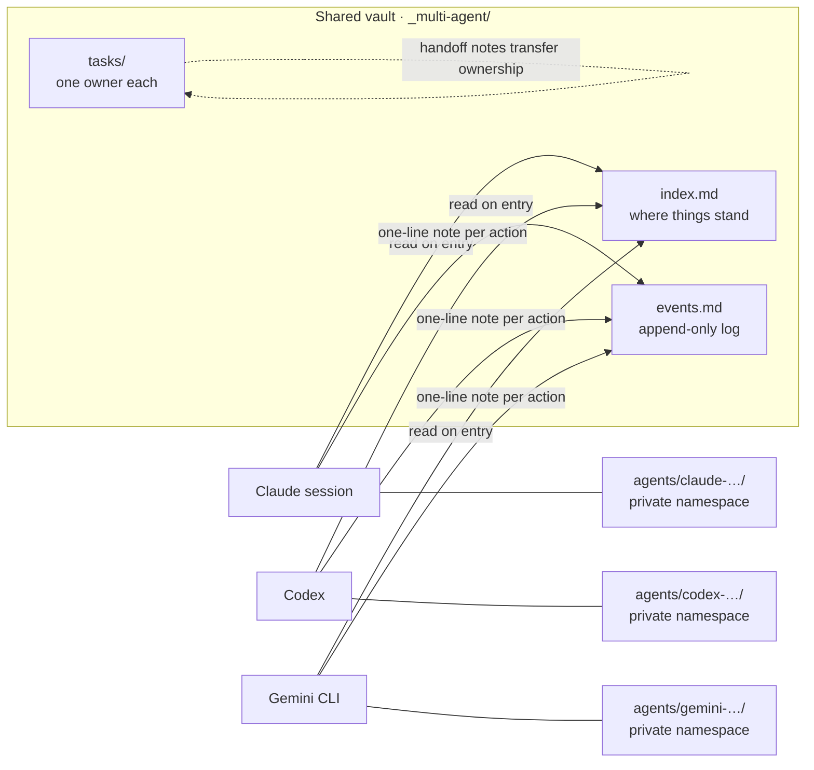

# Agent Vault

[](https://github.com/ymxlx/agent-vault/actions/workflows/tests.yml)
[](LICENSE)


A protocol and Claude Code skill for coordinating multiple AI agents — Claude sessions, Codex, Gemini CLI, or any mix — by treating an Obsidian vault (or any folder of markdown files) as a persistent shared blackboard.

There is no central coordinator. Every agent reads the canonical state on entry, posts a one-line note to a shared append-only log after each meaningful action, and writes detailed work to its own private namespace. The protocol survives both local-filesystem and synced setups (git, Obsidian Sync, Dropbox) without any locking server.

## Install

### As a Claude Code skill

Download the latest `.skill` file from the [Releases](../../releases) page (or build it yourself from this repo) and place it in your Claude Code skills directory. Claude will load it automatically when the description triggers.

To build a `.skill` bundle from a clone of this repo:

```bash
cd agent-vault
zip -r ../agent-vault.skill .
```

### As a plain protocol

You do not need Claude Code to use this. The protocol is just markdown files. Clone this repo, run the bootstrap script against your vault, and any AI tool that can read and write text can participate.

```bash
python3 scripts/init_vault.py \
  --vault-root /path/to/your/vault \
  --agent-id claude-research-myproject \
  --project-name "My Project" \
  --tool "claude-code" \
  --model "claude-opus-4-7" \
  --role "research and writing"
```

The script is idempotent — re-running it never overwrites existing files unless you pass `--force`. Running it with a new `--agent-id` against a vault that already has the protocol just registers the new agent.

## What gets created

Inside `<vault-root>/_multi-agent/`:

```
_multi-agent/
├── AGENT_INSTRUCTIONS.md      # canonical, tool-agnostic protocol
├── README.md                  # human-facing explainer
├── index.md                   # "where things stand" page
├── events.md                  # append-only chronological log
├── agents/<agent-id>/
│   ├── profile.md             # role, capabilities, contact
│   ├── status.md              # current task, blockers, last_seen_event
│   ├── inbox.md               # messages from other agents
│   └── log.md                 # private journal
├── tasks/                     # one file per task, owned by one agent
├── decisions/                 # lightweight ADRs
└── handoffs/                  # task transfer notes
```

At the vault root (so each tool discovers the protocol on session start):

- `CLAUDE.md` — entry pointer for Claude Code
- `AGENTS.md` — entry pointer for Codex (also recognized by Jules, Aider, goose, opencode, Zed, Warp, VS Code, Devin)
- `GEMINI.md` — entry pointer for Gemini CLI
- `.agents/skills/agent-vault/SKILL.md` — Codex-format skill copy

All four point at the same canonical `_multi-agent/AGENT_INSTRUCTIONS.md`. Edit that one file to change the protocol; the pointers stay stable.

Pass `--bridge-tools claude,codex,gemini` to control which entry pointers are written, or `--no-codex-skill` to skip the Codex skill copy.

## How it works



Three rules carry the whole protocol:

1. **Each agent has a private write namespace** (`agents/<self>/` plus tasks it owns). Concurrent writes to disjoint namespaces never conflict.
2. **The shared log is append-only.** `events.md` is line-oriented; conflicts resolve as the union of lines, re-sorted by timestamp.
3. **Task ownership is exclusive at any moment.** Transfers go through a handoff note; both agents' statuses update.

Event lines have a rigid format so any tool — agent or script — can parse them:

```
- YYYY-MM-DD HH:MM | <agent-id> | <verb-phrase> | [[<wikilink>]] | <optional note>
```

Example log excerpt:

```
- 2026-05-13 14:22 | claude-research-pesaj | drafted outline      | [[tasks/literature-review]] | covers 2019–2024, 12 papers
- 2026-05-13 14:25 | codex-frontend-pesaj  | merged auth refactor | [[tasks/jwt-rotation]]      | tests passing, deploy ready
- 2026-05-13 14:40 | gemini-translator-pesaj | blocked on term    | [[tasks/spanish-rollout]]   | need decision on "madrij" vs "leader"
```

The full protocol — entry routine, concurrency rules, handoff ceremony, granularity guidance, failure recovery — lives in `SKILL.md` and `templates/AGENT_INSTRUCTIONS.md`.

## When to use this

Use it whenever you have more than one AI agent touching the same project:

- A research Claude drafting alongside a code Claude implementing
- Claude doing writing while Codex handles refactors
- Cross-tool setups where Claude, Codex, and Gemini CLI all need to know what the others did
- Long-running projects where future sessions need to pick up where prior ones left off

Skip it for single-agent, single-session work. The overhead only pays off when state needs to outlive any one session.

## Repository contents

| Path | What it is |
|------|------------|
| `SKILL.md` | The Claude Code skill definition and protocol explainer |
| `scripts/init_vault.py` | Idempotent bootstrap script — creates the vault structure and registers an agent |
| `templates/AGENT_INSTRUCTIONS.md` | The canonical, tool-agnostic protocol written into every vault |
| `templates/bridge_pointer.md` | Template for the `CLAUDE.md` / `AGENTS.md` / `GEMINI.md` entry pointers |
| `templates/codex_skill.md` | Codex-format skill copy written into `<vault>/.agents/skills/agent-vault/` |
| `references/protocol-spec.md` | Full schema: every frontmatter field, file format, naming convention, event-line grammar |
| `references/templates.md` | Copy-paste templates for every file the protocol uses |
| `references/troubleshooting.md` | Extended failure modes, recovery procedures, scaling guidance |

## License

[MIT](LICENSE) . More details on LICENSE.md doc.
